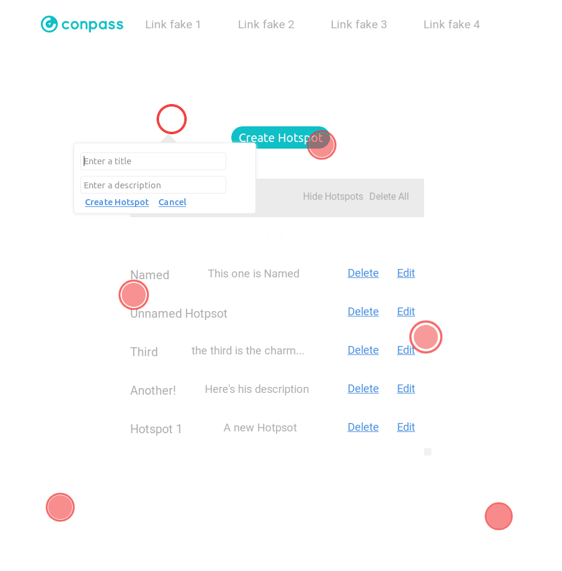

## Hotspoter -- a Conpass Challenge

This is a web-app built in React, built only with functional components and React Hooks, Redux, WebPack and CSS for styling and animations for the creation and manaegment of Hotspots.

At the moment the user can simulate:

- Capturing his mouse position on a given screen
- Highlighting the innermost element under it
- Selecting the position by clicking the location
- Adding the new Hotspot.Tooltip's name directly on a tooltip form
- Hovering over a hotspot to get the created Tooltip to appear
- Highlighting a createad Hotspot on the screen by hovering over the hotspot list
- Editing the title and description of a hotspot directly on it's tooltip
- Deleting a Hospot from the list



Nice stuff:

- The tooltips will change their position if too close to the document edges
- Nice attention grabbing animation for each hotspot
- Conveniently Deleting all Hotspots and bellow too
- Toggling the view of the Hotspots
- It keeps the state on the local storage, so no losing hotspots!

* Did I mentioned it's all functional components and hooks? Hell yeah it's the future baby

## How to run it

```
git clone https://github.com/uryelah/conpass-frontend-challenge.git
npm i
npm start
```

The project will open at the 8080 port

## Known Bugs

- If the movement of capture is too fast while creating a new tooltip last selected elements might keep the red highlight
- Elements with boxShadows or borders might get their style altered by the capture action
- the hospots position might get skewed in window resize
- It's technically possible to create a hotspot over an existing hotspot

## What's next

- Fixing the hotspots positioning on page resizing, probably using and percentage aproach relative to the viewport size
- Refactoring the element capture function for it to change classes instead of affecting directly the element style, possible case for using State.
- Show the details, target element, coordinates, etc, of the Hospot on the listing, I'm thinking a opening details window bellow each on click.
- Make it possible to toggle visibility and animation playing state of each individual hotspot
- stop hotspot creation if it has the same target as another existing hotspot or is too close to it
- Add to each hospot state a counter of time hovered by the user
- Make it possible to toggle visibility of hotspot if already viewd by user or viewd an X amount of times
